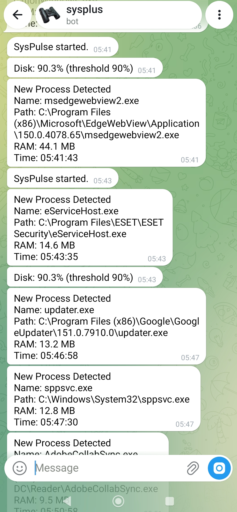

# Syspulse
🛡️SysPulse – The Silent Guardian of Your Windows PC
<h2>Screenshots</h2>

# SysPulse

SysPulse is a lightweight security monitor for Windows. It runs silently in the background and sends instant Telegram alerts when it detects unusual system activity, such as unknown processes, new USB devices, or changes to Windows Defender.

It is designed to be resource-efficient, using less than 30MB of RAM. It only monitors system metadata and processes; it does not read, access, or upload any of your personal files.

## Features

- Detects new or suspicious processes and logs their full file paths.
- Sends immediate alerts when a USB drive is connected.
- Monitors Windows Defender status and alerts if it is disabled or tampered with.
- Tracks basic CPU, RAM, and Disk usage anomalies.
- Optional daily security summary sent directly to your phone.

## Pricing and License

The Pro version is available for a one-time payment of $39. This grants a lifetime license with no recurring subscriptions and includes all future updates. Payments are processed securely via Crypto (USDT / USDC).

A detailed, step-by-step setup guide is included inside the downloaded ZIP file.

## How to Use

1. Purchase a license and download the package.
2. Open the config.ini file and enter your Telegram Bot Token and License Key.
3. Double-click Run.bat to begin monitoring.
4. Use Kill.bat to safely terminate the application when needed.

## Links

Official Website: https://syspulse20.netlify.app
Purchase Link: [ clock  Here](https://phantom.sellix.cx/p/syspulse-5)]

For support or inquiries, please contact: darkssel@proton.me

